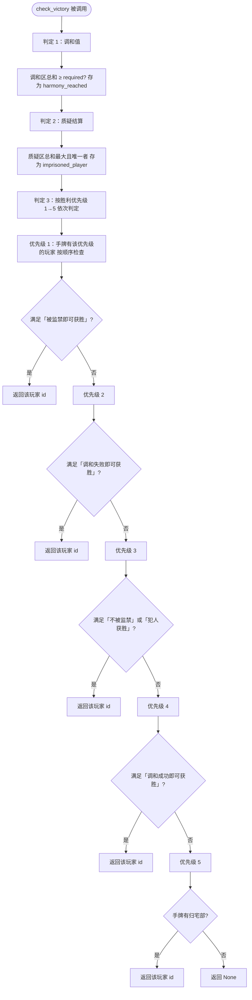

# 后端胜利条件判定流程图

规则来源：`docs/overview.md` — 当所有人都只剩一张手牌时进入胜败判定阶段：**判定 1 调和值 → 判定 2 质疑结算 → 判定 3 按胜利优先级依次公开手牌并判定**。  
`VictoryChecker.check_victory()` 仅在**对局已结束**（`game.state == GAME_OVER`）时由 `server._handle_play_card` 调用，返回 `winner_id` 或 `None`。

---

## check_victory 调用时机分析

### 唯一调用点

全后端**仅有一处**调用 `check_victory`：

| 文件 | 方法 | 位置 |
|------|------|------|
| `backend/websocket/server.py` | `_handle_play_card` | 在 `game_rules.play_card(...)` 返回 `True` 之后 |

### 触发链路

```
客户端发送 play_card 消息
    → handle_message(websocket, message)
    → message_type == "play_card"
    → _handle_play_card(data)
    → game_rules.play_card(...) 执行出牌（改状态、next_turn 等）
    → 若 success 为 True：
        1. await _broadcast_game_state()   // 先广播最新对局状态
        2. 若 game.state == GAME_OVER（所有人仅剩一张手牌）：
             victory_checker = VictoryChecker(self.game_manager.game)
             winner = victory_checker.check_victory()
             if winner: await _broadcast_game_over(winner)
```

### 时机要点

1. **仅在「对局结束」时判定**：根据规则，**只有当所有人手牌都只剩 1 张**（即对局结束）时才进行胜利判定。服务端在出牌成功并 `_broadcast_game_state()` 之后，**仅当 `game.state == GameState.GAME_OVER`** 时才调用 `check_victory()`；`GAME_OVER` 由 `state.next_turn()` 在 `_check_game_end_condition()` 为真时设置（每人手牌 ≤ 1）。
2. **只在出牌成功后**：`play_card` 失败时不会广播 `game_state`，也不会进入胜利判定。
3. **先广播状态，再判胜**：先 `_broadcast_game_state()`，再在满足上述条件时 `check_victory()`；若有胜者则 `_broadcast_game_over(winner)`。
4. **以下情况不会调用 `check_victory`**：
   - 登录、重连、开始游戏、获取状态、优等生响应等其它消息；
   - 出牌失败；
   - 出牌成功但尚未满足「所有人仅剩一张手牌」（即 `game.state != GAME_OVER`）。

### 小结

| 项目 | 说明 |
|------|------|
| 谁调 | `GameWebSocketServer._handle_play_card` |
| 何时 | 某玩家**成功**出牌后，且**对局已结束**（`game.state == GAME_OVER`，即所有人手牌 ≤ 1） |
| 入参 | 无（用 `self.game_manager.game` 当前状态） |
| 出参 | `Optional[str]`：胜者 `player_id` 或 `None` |
| 后续 | 若有胜者则 `_broadcast_game_over(winner)`，否则无额外操作 |

---

## 总览流程图（Mermaid）



---

## 分支说明（与 overview 一致）

### 判定 1：调和值

- 计算**调和区**卡牌 `harmony_value` 之和是否 ≥ `required_harmony_value`（人数 + 1）。
- 结果存为 `harmony_reached`，供判定 3 使用，**不在此处直接决定胜者**。

### 判定 2：质疑结算

- 对每名玩家计算其**质疑区**（放在该玩家面前的质疑牌）的 `harmony_value` 总和。
- 若存在**唯一**总和最大的玩家，该玩家视为**被监禁**，存为 `imprisoned_player`。
- 供判定 3 使用，**不在此处直接决定胜者**。

### 判定 3：胜利条件判定（按优先级 1→5）

- **顺序**：按胜利优先级 **1 → 2 → 3 → 4 → 5** 依次检查（低优先级先判定）。
- **每一级**：找出「手牌中拥有该优先级卡牌」的玩家，按在 `game.players` 中的顺序依次检查；若某玩家手牌中**任一张**该优先级的卡满足其胜利条件，则**立即返回该玩家 id**，不再检查后续优先级。
- **同一优先级多人**：按玩家顺序先满足者胜。

| 优先级 | 角色示例     | 胜利条件文案             | 判定方式 |
|--------|--------------|--------------------------|----------|
| 1      | 外星人       | 被监禁即可获胜           | 该玩家是否为 imprisoned_player |
| 2      | 感染者       | 调和失败即可获胜         | 否 harmony_reached |
| 3      | 犯人 / 共犯 / 优等生 | 不被监禁 / 犯人获胜即可获胜 | 该玩家未被监禁；或 犯人方胜（被监禁者手牌无犯人） |
| 4      | 学生会长、班长等 | 调和成功即可获胜     | harmony_reached |
| 5      | 归宅部       | 无任何人胜利             | 能轮到优先级 5 即表示无人 1→4 满足，持归宅部者胜 |

---

## 简图（文字版）

```
所有人只剩一张手牌 → 进入胜败判定
  → 判定 1：调和区总和 ≥ 要求？ → 存 harmony_reached
  → 判定 2：质疑区总和最大且唯一者 → 存 imprisoned_player
  → 判定 3：按优先级 1→5 依次
        1：有「被监禁即可获胜」且该玩家被监禁？ → 先满足者胜
        2：有「调和失败即可获胜」且未调和达成？ → 先满足者胜
        3：有「不被监禁」或「犯人获胜」且条件成立？ → 先满足者胜
        4：有「调和成功即可获胜」且调和达成？ → 先满足者胜
        5：有「无任何人胜利」？ → 先满足者胜
  → 均不满足则返回 None
```
